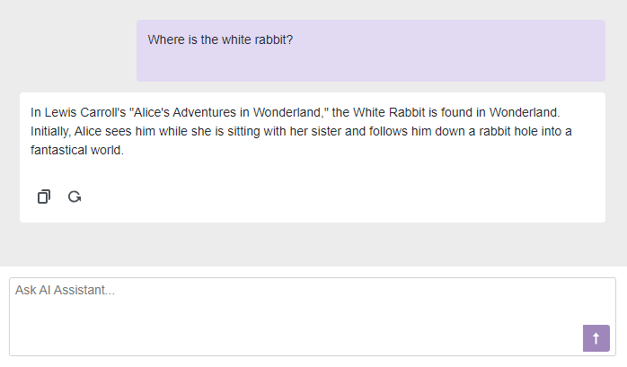

<!-- default badges list -->

[](https://supportcenter.devexpress.com/ticket/details/T1251539)
[](https://docs.devexpress.com/GeneralInformation/403183)
[](#does-this-example-address-your-development-requirementsobjectives)
<!-- default badges end -->

# Blazor AI Chat - How to add the DevExpress Blazor AI Chat component to your next Blazor, MAUI, WPF, and WinForms application

The DevExpress Blazor AI Chat component ([DxAIChat](https://docs.devexpress.com/Blazor/DevExpress.AIIntegration.Blazor.Chat.DxAIChat?v=24.2)) allows you to incorporate AI-powered interactions into any Blazor/MAUI/WPF/WinForms application. Our AI Chat component ships with a variety of high impact features, including:

* [Customizable message appearance and empty message area](#customize-message-appearance-and-empty-message-area)
* [Text or markdown response](#text-or-markdown-response)
* [Manual message processing](#manual-message-processing)
* [Streaming response](#streaming-response)

## Implementation Details

This example adds a [DxAIChat](https://docs.devexpress.com/Blazor/DevExpress.AIIntegration.Blazor.Chat.DxAIChat?v=24.2) to a Blazor application, customizes its settings, and integrates it into WinForms, WPF, and .NET MAUI applications.

### Register AI Service

> [!NOTE]  
> DevExpress AI-powered extensions follow the "bring your own key" principle. DevExpress does not offer a REST API and does not ship any built-in LLMs/SLMs. You need an active Azure/Open AI subscription to obtain the REST API endpoint, key, and model deployment name. These variables must be specified at application startup to register AI clients and enable DevExpress AI-powered Extensions in your application.

Add the following code to the _Program.cs_ file to register the AI Chat service in your application:

```cs
using Azure.AI.OpenAI;
using DevExpress.AIIntegration;
using Microsoft.Extensions.AI;
using System.ClientModel;

string azureOpenAIEndpoint = Environment.GetEnvironmentVariable("AZURE_OPENAI_ENDPOINT");
string azureOpenAIKey = Environment.GetEnvironmentVariable("AZURE_OPENAI_API_KEY");
string deploymentName = string.Empty;
...
var azureClient = new AzureOpenAIClient(
    new Uri(azureOpenAIEndpoint),
    new ApiKeyCredential(azureOpenAIKey));

builder.Services.AddDevExpressBlazor();
builder.Services.AddChatClient(azureClient);
```

File to review: [Program.cs](./CS/DevExpress.AI.Samples.Blazor/Program.cs)

> [!Tip]
> Refer to the following help topic for instructions on registering OpenAI, Azure OpenAI, Ollama, and Semantic Kernel: [Register AI Clients](https://docs.devexpress.com/CoreLibraries/405204/ai-powered-extensions#register-ai-clients).

> [!Note]
> We use the following versions of the `Microsoft.Extensions.AI.*` libraries in our source code:
>
> v24.2.6+ | **9.3.0-preview.1.25161.3**
>
> We do not guarantee compatibility or correct operation with higher versions. Refer to the following announcement for additional information: [Microsoft.Extensions.AI.Abstractions NuGet Package Version Upgrade in v24.2.6](https://community.devexpress.com/blogs/news/archive/2025/03/12/important-announcement-microsoft-extensions-ai-abstractions-nuget-package-version-upgrade.aspx).

### Add DxAIChat component to a Blazor Application

Add a `<DxAIChat>…</DxAIChat>` markup to a .razor file:

```razor
@using DevExpress.AIIntegration.Blazor.Chat
@using AIIntegration.Services.Chat;

<DxAIChat CssClass="my-chat" />
```

```css
.my-chat {
    width: 700px;
    margin: 20px;
}
```




File to review: [Chat.razor](./CS/DevExpress.AI.Samples.Blazor/Components/Pages/Chat.razor)

### Customize message appearance and empty message area

[DxAIChat](https://docs.devexpress.com/Blazor/DevExpress.AIIntegration.Blazor.Chat.DxAIChat?v=24.2) component includes the following message customization properties:

* [MessageTemplate](https://docs.devexpress.com/Blazor/DevExpress.AIIntegration.Blazor.Chat.DxAIChat.MessageTemplate?v=24.2) - specifies the template used for message bubbles.
* [MessageContentTemplate](https://docs.devexpress.com/Blazor/DevExpress.AIIntegration.Blazor.Chat.DxAIChat.MessageContentTemplate?v=24.2) - specifies the template used for message bubble content.
* [EmptyMessageAreaTemplate](https://docs.devexpress.com/Blazor/DevExpress.AIIntegration.Blazor.Chat.DxAIChat.EmptyMessageAreaTemplate?v=24.2) - specifies the template used for the empty message area.

```razor
<DxAIChat CssClass="my-chat">
    <EmptyMessageAreaTemplate>
        <div class="my-chat-ui-description">
            AI Assistant is ready to answer your questions.
        </div>
    </EmptyMessageAreaTemplate>
    <MessageTemplate>
        <div class="@GetMessageClasses(context)">
            @if(context.Typing) {
                <span>Loading...</span>
            } else {
                <div class="my-chat-content">
                    @context.Content
                </div>
            }
        </div>
    </MessageTemplate>
</DxAIChat>
```

File to review: [Chat-CustomMessage.razor](./CS/DevExpress.AI.Samples.Blazor/Components/Pages/Chat-CustomMessage.razor), [Chat-CustomEmptyState.razor](./CS/DevExpress.AI.Samples.Blazor/Components/Pages/Chat-CustomEmptyState.razor)

### Text or markdown response

The AI service uses plain text as the default response format.

To display rich formatted messages, set the [ResponseContentFormat](https://docs.devexpress.com/Blazor/DevExpress.AIIntegration.Blazor.Chat.DxAIChat.ResponseContentFormat?v=24.2) property to `Markdown`. Use a markdown processor to convert response content to HTML code.

```razor
@using Markdig;

<DxAIChat CssClass="my-chat" RenderMode="AnswerRenderMode.Markdown">
    <MessageContentTemplate>
        <div class="my-chat-content">
            @ToHtml(context.Content)
        </div>
    </MessageContentTemplate>
</DxAIChat>

@code {
    MarkupString ToHtml(string text) {
        return (MarkupString)Markdown.ToHtml(text);
    }
}
```

### Manual message processing

When a user sends a message to the chat, the [MessageSent](https://docs.devexpress.com/Blazor/DevExpress.AIIntegration.Blazor.Chat.DxAIChat.MessageSent?v=24.2) event fires. Handle the event to manually process this action. 
You can use the [Content](https://docs.devexpress.com/Blazor/DevExpress.AIIntegration.Blazor.Chat.MessageSentEventArgs.Content?v=24.2) event argument to access user input and call the [SendMessage](https://docs.devexpress.com/Blazor/DevExpress.AIIntegration.Blazor.Chat.DxAIChat.SendMessage(System.String-Microsoft.Extensions.AI.ChatRole)?v=24.2) method to send another message to the chat.

```razor
<DxAIChat CssClass="my-chat" MessageSent="MessageSent" />

@code {
    async Task MessageSent(MessageSentEventArgs args) {
        await args.Chat.SendMessage($"Processed: {args.Content}", Microsoft.Extensions.AI.ChatRole.Assistant);
    }
}
```

File to review: [Chat-MessageSent.razor](./CS/DevExpress.AI.Samples.Blazor/Components/Pages/Chat-MessageSent.razor)


### Streaming response

After a user sends a request, the AI client generates and sends the entire response back. This operation may be time consuming. To make the chat appear more responsive, set the [UseStreaming](https://docs.devexpress.com/Blazor/DevExpress.AIIntegration.Blazor.Chat.DxAIChat.UseStreaming?v=24.2) property to `true`. In this instance, the AI client transmits parts of the response as it becomes available and the chat component adds these parts to the display message.

```razor
<DxAIChat CssClass="my-chat" UseStreaming="true" />
```

File to review: [Chat-Streaming.razor](./CS/DevExpress.AI.Samples.Blazor/Components/Pages/Chat-Streaming.razor)

### Compatibility with OpenAI assistants

The DevExpress AI Chat ([DxAIChat](https://docs.devexpress.com/Blazor/DevExpress.AIIntegration.Blazor.Chat.DxAIChat?v=24.2)) component supports [OpenAI Assistants](https://techcommunity.microsoft.com/t5/ai-azure-ai-services-blog/announcing-azure-openai-service-assistants-public-preview/ba-p/4143217). This allows you to specify a model and supply supplementary documents (external knowledge). OpenAI parses these documents and searches through them to retrieve relevant content to answer user queries.

> [!NOTE]  
> Availability of Azure Open AI Assistants depends on the region. Refer to the following article for more details: [Assistants (Preview)](https://learn.microsoft.com/en-us/azure/ai-services/openai/concepts/models?tabs=global-standard%2Cstandard-chat-completions#assistants-preview).

Add the following code to the _Program.cs_ file to register AI Assistant service in the application:

```cs
builder.Services.AddDevExpressAI((config) => {
    //Reference the DevExpress.AIIntegration.OpenAI NuGet package to use Open AI Assistants
    config.RegisterOpenAIAssistants(azureClient, "gpt4o"); 
});
```

Include a supplementary document in the project file as an `EmbeddedResource`:

```
<EmbeddedResource Include="Data\Restaurant Menu.pdf" />
```

Handle the [Initialized](https://docs.devexpress.com/Blazor/DevExpress.AIIntegration.Blazor.Chat.DxAIChat.Initialized?v=24.2) event and call the [SetupAssistantAsync](https://docs.devexpress.com/Blazor/DevExpress.AIIntegration.Blazor.Chat.IAIChat.SetupAssistantAsync.overloads?v=24.2) method to supply a file to the Open AI Assistant. 

```razor
<DxAIChat CssClass="my-chat" Initialized="Initialized" />

@code {
    const string DocumentResourceName = "DevExpress.AI.Samples.Blazor.Data.Restaurant Menu.pdf";
    const string prompt = "...";

    async Task Initialized(IAIChat chat) {
        await chat.SetupAssistantAsync(new OpenAIAssistantOptions(
            $"{Guid.NewGuid().ToString("N")}.pdf",
            Assembly.GetExecutingAssembly().GetManifestResourceStream(DocumentResourceName),
            prompt)
        );
    }
}
```

File to review: [Chat-Assistant.razor](./CS/DevExpress.AI.Samples.Blazor/Components/Pages/Chat-Assistant.razor)

### <a name="integration"></a> Integrate AI Chat into WinForms, WPF and .NET MAUI Apps

Thanks to both Blazor Hybrid technology and the BlazorWebView component, you can integrate DevExpress AI Chat ([DxAIChat](https://docs.devexpress.com/Blazor/DevExpress.AIIntegration.Blazor.Chat.DxAIChat?v=24.2)) into your next great WinForms, WPF, and .NET MAUI application.

Keys to implementation are as follows:

* The `ISelfEncapsulationService` interface allows you to work directly with the [DxAIChat](https://docs.devexpress.com/Blazor/DevExpress.AIIntegration.Blazor.Chat.DxAIChat?v=24.2) component instance/properties from your desktop or mobile app.
* Built-in [DxAIChat](https://docs.devexpress.com/Blazor/DevExpress.AIIntegration.Blazor.Chat.DxAIChat?v=24.2) wrappers initialize required Blazor Theme scripts.
* Custom CSS classes hide the built-in input field and the Send button (see _index.html_).

Folders to review: [DevExpress.AI.Samples.MAUIBlazor](./CS/DevExpress.AI.Samples.MAUIBlazor/), [DevExpress.AI.Samples.WPFBlazor](./CS/DevExpress.AI.Samples.WPFBlazor/)
For more information on how to use AI extensions in WPF apps, refer to the following help topic: [AI-powered Extensions for WPF](https://docs.devexpress.com/WPF/405223/ai-powered-extensions?v=24.2)

For WinForms apps, use the built-in `AIChatControl` component. Refer to the following help topic to learn more about the integration steps: [AI Chat Control Documentation](https://docs.devexpress.com/WindowsForms/405218/ai-powered-extensions/ai-chat-control?v=24.2)

Folders to review: [DevExpress.AI.Samples.WinBlazor](./CS/DevExpress.AI.Samples.WinBlazor/)

## Files to Review

* [Chat.razor](./CS/DevExpress.AI.Samples.Blazor/Components/Pages/Chat.razor)
* [Chat-CustomMessage.razor](./CS/DevExpress.AI.Samples.Blazor/Components/Pages/Chat-CustomMessage.razor)
* [Chat-CustomEmptyState.razor](./CS/DevExpress.AI.Samples.Blazor/Components/Pages/Chat-CustomEmptyState.razor)
* [Chat-MessageSent.razor](./CS/DevExpress.AI.Samples.Blazor/Components/Pages/Chat-MessageSent.razor)
* [Chat-Streaming.razor](./CS/DevExpress.AI.Samples.Blazor/Components/Pages/Chat-Streaming.razor)
* [Chat-Assistant.razor](./CS/DevExpress.AI.Samples.Blazor/Components/Pages/Chat-Assistant.razor)
* [Program.cs](./CS/DevExpress.AI.Samples.Blazor/Program.cs)

## Folders to Review

* [DevExpress.AI.Samples.MAUIBlazor](./CS/DevExpress.AI.Samples.MAUIBlazor/)
* [DevExpress.AI.Samples.WinBlazor](./CS/DevExpress.AI.Samples.WinBlazor/)
* [DevExpress.AI.Samples.WPFBlazor](./CS/DevExpress.AI.Samples.WPFBlazor/)

## Documentation

* [DevExpress AI-powered Extensions for Blazor](https://docs.devexpress.com/Blazor/405228/ai-powered-extensions)
* [DevExpress Blazor AI Chat Control](https://docs.devexpress.com/Blazor/DevExpress.AIIntegration.Blazor.Chat.DxAIChat)
* [Create a Blazor Hybrid Project](https://docs.devexpress.com/Blazor/404118/get-started/create-project-hybrid)

## Online Demo

* [AI-powered Extensions: AI Chat](https://demos.devexpress.com/blazor/AI/Chat#Overview)

## More Examples

* [Rich Text Editor and HTML Editor for Blazor — How to integrate AI-powered extensions](https://github.com/DevExpress-Examples/blazor-ai-integration-to-text-editors)
* [Blazor Grid and Report Viewer — Incorporate an AI Assistant (Azure OpenAI) in your next DevExpress-powered Blazor app](https://github.com/DevExpress-Examples/blazor-grid-and-report-viewer-integrate-ai-assistant)

<!-- feedback -->
## Does this example address your development requirements/objectives?

[](https://www.devexpress.com/support/examples/survey.xml?utm_source=github&utm_campaign=devexpress-ai-chat-samples&~~~was_helpful=yes) [](https://www.devexpress.com/support/examples/survey.xml?utm_source=github&utm_campaign=devexpress-ai-chat-samples&~~~was_helpful=no)

(you will be redirected to DevExpress.com to submit your response)
<!-- feedback end -->

